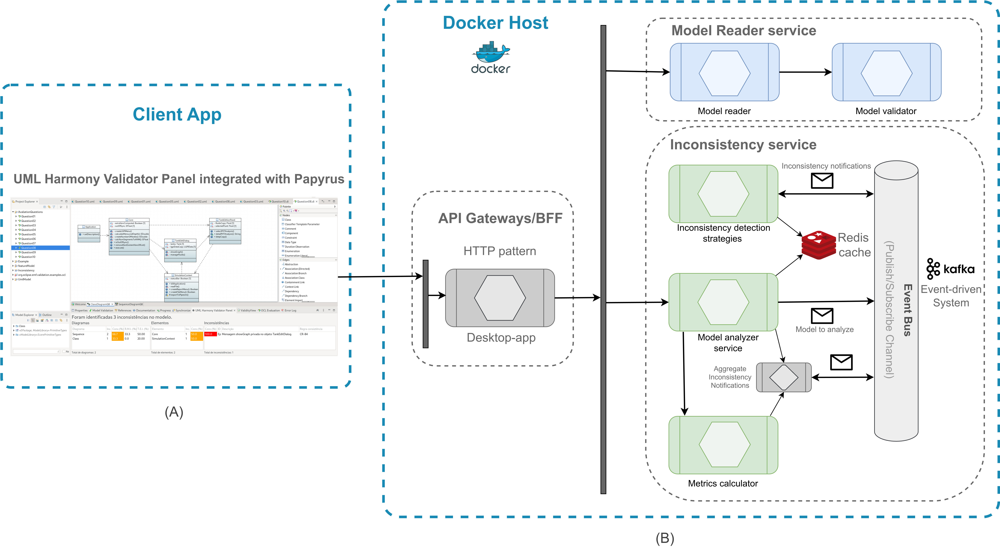

# UML Harmony Validator Server - detection of inconsistencies

A API that analyze UML models to find inconsistencies.

- [UML Harmony Validator Server - detection of inconsistencies](#uml-harmony-validator-server---detection-of-inconsistencies)
  - [🧭 Overview](#-overview)
    - [🔍 Supported Inconsistency Types](#-supported-inconsistency-types)
  - [🏗️ Architecture](#️-architecture)
  - [🚀 Getting Started](#-getting-started)
    - [🔧 Prerequisites](#-prerequisites)
    - [📦 Installation](#-installation)
  - [▶️ Run the Service](#️-run-the-service)
    - [🐳 Using Docker](#-using-docker)
    - [⚙️ Running the Application](#️-running-the-application)
  - [💻 Usage](#-usage)
    - [🔎 Analyze a UML Model](#-analyze-a-uml-model)
      - [Request (cURL)](#request-curl)
      - [Example Response](#example-response)
      - [Request (cURL)](#request-curl-1)
      - [Example Response](#example-response-1)
  - [📄 License](#-license)

## 🧭 Overview

**UML Harmony Validator Server** is a backend service that analyzes **UML Class and Sequence Diagrams** to detect **inconsistencies** based on the UML model file provided in the request.
It helps ensure the **consistency and correctness** between different UML views of a software system.

### 🔍 Supported Inconsistency Types

| Code     | Description                                                                 |
| -------- | --------------------------------------------------------------------------- |
| **Cm**   | Multiple definitions of classes with the same name.                         |
| **Om**   | Multiple definitions of objects with the same name.                         |
| **CnSD** | Class not instantiated in the Sequence Diagram.                             |
| **CnCD** | Object without an associated class in the Class Diagram.                    |
| **ED**   | Message sent in the wrong direction.                                        |
| **EnM**  | Message without a corresponding method.                                     |
| **EnN**  | Message without a name.                                                     |
| **MnSD** | Method defined in the Class Diagram but not called in the Sequence Diagram. |
| **ACSD** | Abstract class instantiated in the Sequence Diagram.                        |
| **CnoM** | Class without any defined methods.                                          |
| **OnN**  | Object without a name.                                                      |
| **EpM**  | Message calling a private method in the Class Diagram.                      |

## 🏗️ Architecture

* **HTTP REST** communication
* **Spring Boot** application with **Apache Kafka** integration
* **Redis** for caching and fast data access
* **Dockerized** with `docker-compose` for local deployment
* **Maven** for build and dependency management

> The box on the right side (B) in the architecture diagram represents this service.



## 🚀 Getting Started

### 🔧 Prerequisites

Before running the service, ensure the following are installed:

1. **[Docker](https://www.docker.com/)**
2. **Java 17** — [Download JDK 17](https://www.oracle.com/java/technologies/javase/jdk17-archive-downloads.html)
3. **Maven 3.5+** — [Apache Maven](https://maven.apache.org/)

   * Quick reference: [Maven Commands Cheat Sheet](https://www.digitalocean.com/community/tutorials/maven-commands-options-cheat-sheet#maven-commands-cheat-sheet)

> [!TIP]
> To manage Java and Maven versions easily, consider using [ASDF Version Manager](https://asdf-vm.com/) or another tool of your choice.

### 📦 Installation

1. Clone this repository:

   ```bash
   gh repo clone luanlazz/uml-harmony-validator-service
   ```
2. Move into the project directory:

   ```bash
   cd uml-harmony-validator-service
   ```

## ▶️ Run the Service

### 🐳 Using Docker

1. Navigate to the resources directory:

   ```bash
   cd src/main/resources
   ```
2. Start the local infrastructure (Kafka, Redis, etc.):

   ```bash
   docker compose up -d
   ```
3. Verify that the containers are running:

   ```bash
   docker ps
   ```

### ⚙️ Running the Application

Once the dependencies are running, start the Spring Boot application:

```bash
mvn spring-boot:run
```

The API will be available at:
👉 **[http://localhost:8080](http://localhost:8080)**

## 💻 Usage

This service exposes REST endpoints that allow you to submit a UML model for analysis and retrieve the detected inconsistencies.

### 🔎 Analyze a UML Model

<details>
  <summary><strong>1. Submit a UML file for analysis</strong></summary>

#### Request (cURL)

```bash
curl --location 'http://localhost:8080/kafka/send' \
  --header 'Accept-Language: pt' \
  --form 'file=@"/home/Documents/Question09.uml"'
```

#### Example Response

```json
{
  "clientId": "17610130919861",
  "success": "true"
}
```

</details>

---

<details>
  <summary><strong>2. Retrieve analysis results</strong></summary>

#### Request (cURL)

```bash
curl --location 'http://localhost:8080/kafka/inconsistencies/{client_id}'
```

#### Example Response

```json
{
  "data": {
    "inconsistencies": [
      {
        "clientId": "17610130919861",
        "inconsistencyTypeCode": "EnM",
        "inconsistencyTypeDesc": "Mensagem sem Método",
        "cr": "R110",
        "severity": 3,
        "severityLabel": "HIGH",
        "concentration": 1.0,
        "concentrationStr": "100.0",
        "description": "Mensagem addReturnedCheck não foi definida no objeto CheckNotation.",
        "elId": "_fD1tMDXDEe-bA-KOUZ90WA",
        "parentId": "_SVX2gDXDEe-bA-KOUZ90WA"
      },
      {
        "clientId": "17610130919861",
        "inconsistencyTypeCode": "ED",
        "inconsistencyTypeDesc": "Mensagem na direção Errada",
        "cr": "R110",
        "severity": 3,
        "severityLabel": "HIGH",
        "concentration": 1.0,
        "concentrationStr": "100.0",
        "description": "Mensagem addReturnedCheck na direção errada pois está definida na classe CheckingAccountClass.",
        "elId": "_fD1tMDXDEe-bA-KOUZ90WA",
        "parentId": "_SVX2gDXDEe-bA-KOUZ90WA"
      }
      // ...
    ],
    "diagrams": [
      {
        "id": "_6TfJoDWoEe-bA-KOUZ90WA",
        "name": "Sequence",
        "numInconsistencies": 7,
        "concentration": 1.0,
        "concentrationStr": "100.0",
        "severity": 3,
        "severityLabel": "HIGH"
      }
    ],
    "diagramStatistics": [
      {
        "id": "_6TfJoDWoEe-bA-KOUZ90WA",
        "riskMisinterpretation": 40.0,
        "spreadRate": 66.67,
        "concentrationInc": 100.0
      }
    ]
  },
  "success": "true"
}
```

</details>

## 📄 License

This repository is licensed under the **Creative Commons Attribution–NonCommercial 4.0 International License**.
You may **not** use this material for commercial purposes.
See the [LICENSE](LICENSE) file for full details.