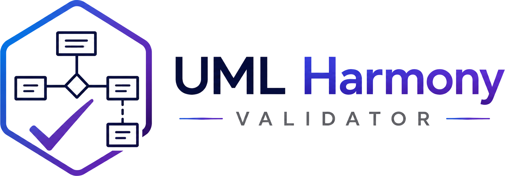
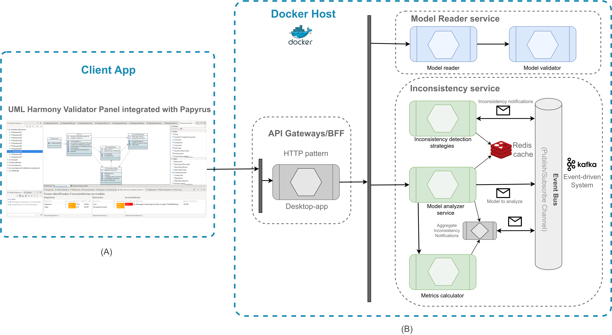

# UML Harmony Validator Server - detection of inconsistencies

A API that analyze UML models to find inconsistencies.

- [UML Harmony Validator Server - detection of inconsistencies](#uml-harmony-validator-server---detection-of-inconsistencies)
  - [Overview](#overview)
    - [Supported Inconsistency Types](#supported-inconsistency-types)
  - [Architecture](#architecture)
    - [Overview](#overview-1)
    - [Technology stack](#technology-stack)
    - [Flow diagram](#flow-diagram)
  - [Getting Started](#getting-started)
    - [Prerequisites](#prerequisites)
    - [Installation](#installation)
  - [Run the Service](#run-the-service)
    - [1. Start the infrastructure with Docker](#1-start-the-infrastructure-with-docker)
    - [2. Start the Spring Boot application](#2-start-the-spring-boot-application)
  - [Usage](#usage)
    - [Analyze a UML Model](#analyze-a-uml-model)
      - [Request (cURL)](#request-curl)
      - [Example Response](#example-response)
      - [Request (cURL)](#request-curl-1)
      - [Example Response](#example-response-1)
  - [License](#license)

## Overview

**UML Harmony Validator Server** is a backend service that analyzes **UML Class and Sequence Diagrams** to detect **inconsistencies** based on the UML model file provided in the request.
It helps ensure the **consistency and correctness** between different UML views of a software system.

### Supported Inconsistency Types
 
| Code | Name / Description | Formal Definition | CR | Diagrams |
| ---- | ------------------ | ----------------- | -- | -------- |
| **Cm** | **Class Multiplicity**<br>Multiple definitions of classes with the same name. | `IF not classUniqueName THEN Cm inconsistency` | UML | CD |
| **Om** | **Object Multiplicity**<br>Multiple definitions of objects with the same name. | `IF not lifelineUniqueName THEN Om inconsistency` | UML | SD |
| **CnSD** | **Class not in Sequence Diagram**<br>Class not instantiated in the Sequence Diagram. | `IF not R115 THEN CnSD inconsistency` | R115 | CD, SD |
| **CnCD** | **Class not in Class Diagram**<br>Object without an associated class in the Class Diagram. | `IF not classExists THEN CnCD inconsistency` | UML | SD, CD |
| **ED** | **Erroneous Direction**<br>Message sent in the wrong direction. | `IF not R110 and messageBelongSender THEN ED inconsistency` | R110 | SD, CD |
| **EnM** | **Element without Method**<br>Message without a corresponding method. | `IF not R110 THEN EnM inconsistency` | R110 | SD, CD |
| **EnN** | **Element without Name**<br>Message without a name. | `IF not messageName THEN EnN inconsistency` | UML | SD |
| **MnSD** | **Method not in Sequence Diagram**<br>Method defined in the Class Diagram but not called in the Sequence Diagram. | `IF not R114 THEN MnSD inconsistency` | R114 | CD, SD |
| **ACSD** | **Abstract Class in Sequence Diagram**<br>Abstract class instantiated in the Sequence Diagram. | `IF not R108 THEN ACSD inconsistency` | R108 | CD, SD |
| **CnoM** | **Class without Methods**<br>Class without any defined methods. | `IF not classHasMethod THEN CnoM inconsistency` | UML | CD |
| **OnN** | **Object without Name**<br>Object without a name. | `IF not objectName THEN OnN inconsistency` | UML | SD |
| **EpM** | **Element with Private Method**<br>Message calling a private method in the Class Diagram. | `IF not R116 THEN EpM inconsistency` | R116 | SD, CD |

> **CD** = Class Diagram · **SD** = Sequence Diagram · **CR** = Consistency Rule

## Architecture

### Overview


> The box on the right side (B) in the architecture diagram represents this service.

### Technology stack

* **HTTP REST** communication
* **Spring Boot** application with **Apache Kafka** integration
* Detection strategies execute in **parallel** via Kafka consumer groups — one per inconsistency type
* Results aggregated in a **Kafka Streams** state store and compiled upon completion of all strategies
* **Redis** for model caching and fast data access during analysis
* **SSE (Server-Sent Events)** to push analysis results to the client as soon as all strategies complete
* **Dockerized** with `docker-compose` for local deployment
* **Maven** for build and dependency management

### Flow diagram

```
┌─────────────────────────────────────────────────────────────────┐
│                        Eclipse Plugin (A)                       │
│  POST /api/analysis/model ──────────────► GET /api/analysis/    │
│  (submit UML file)                        stream/{clientId}     │
└──────────────────────────┬──────────────────────▲──────────────┘
                           │                      │ SSE event
                           ▼                      │ (result ready)
┌─────────────────────────────────────────────────────────────────┐
│                   Spring Boot Service (B)                       │
│                                                                 │
│  REST Controller ──► Kafka Producer ──► topic: model-to-analyze │
│                                                  │              │
│                          ┌───────────────────────┘              │
│                          ▼  (parallel consumers)                │
│              ┌──────────────────────────┐                       │
│              │   Detection Strategies   │                       │
│              │  Cm  Om  CnSD  CnCD  ED  │                       │
│              │  EnM EnN MnSD ACSD CnoM  │                       │
│              │         OnN  EpM         │                       │
│              └────────────┬─────────────┘                       │
│                           │ each publishes to                   │
│                           ▼ topic: inconsistencies              │
│              ┌────────────────────────┐                         │
│              │   Kafka Streams Store  │◄── StrategyCompletion   │
│              │  (aggregate results)   │    Service (counter)    │
│              └────────────┬───────────┘                         │
│                           │                                     │
│              ┌────────────▼───────────┐                         │
│              │  InconsistencyCompiler │──► SseNotification      │
│              │  + ModelMetrics        │    Service ──► client   │
│              └────────────────────────┘                         │
│                                                                 │
│  Redis: UML model cache per clientId                            │
└─────────────────────────────────────────────────────────────────┘
```

## Getting Started

### Prerequisites

Before running the service, ensure the following are installed:

1. **[Docker](https://www.docker.com/)**
2. **Java 17** — [Download JDK 17](https://www.oracle.com/java/technologies/javase/jdk17-archive-downloads.html)
3. **Maven 3.5+** — [Apache Maven](https://maven.apache.org/)

   * Quick reference: [Maven Commands Cheat Sheet](https://www.digitalocean.com/community/tutorials/maven-commands-options-cheat-sheet#maven-commands-cheat-sheet)

> [!TIP]
> To manage Java and Maven versions easily, consider using [ASDF Version Manager](https://asdf-vm.com/) or another tool of your choice.

### Installation

1. Clone this repository:

   ```bash
   gh repo clone luanlazz/uml-harmony-validator-service
   ```
2. Move into the project directory:

   ```bash
   cd uml-harmony-validator-service
   ```

## Run the Service

### 1. Start the infrastructure with Docker

Navigate to the resources directory where `docker-compose.yml` is located:
 
```bash
cd src/main/resources
docker compose up -d
```
 
Verify all containers are running (Kafka, Zookeeper, Redis):
 
```bash
docker ps
```


### 2. Start the Spring Boot application
 
Go back to the project root before running Maven:
 
```bash
cd ../../..
mvn spring-boot:run
```
 
> [!IMPORTANT]
> `mvn spring-boot:run` must be executed from the project root (where `pom.xml` is located).
 
The API will be available at:
**[http://localhost:8080/api/analysis](http://localhost:8080/api/analysis)**

## Usage

This service exposes REST endpoints that allow you to submit a UML model for analysis and retrieve the detected inconsistencies.

### Analyze a UML Model

<details>
  <summary><strong>1. Submit a UML file for analysis</strong></summary>

#### Request (cURL)

```bash
curl --location 'http://localhost:8080/api/analysis/model' \
  --header 'Accept-Language: en' \
  --form 'file=@"/home/Documents/Question09.uml"'
```

#### Example Response

```json
{
  "clientId": "17610130919861",
  "success": "true"
}
```

</details>

---

<details>
  <summary><strong>2. Retrieve analysis results</strong></summary>

#### Request (cURL)

```bash
curl --location 'http://localhost:8080/api/analysis/stream/{client_id}'
```

#### Example Response

```json
{
  "data": {
    "inconsistencies": [
      {
        "clientId": "17610130919861",
        "inconsistencyTypeCode": "EnM",
        "inconsistencyTypeDesc": "Mensagem sem Método",
        "cr": "R110",
        "severity": 3,
        "severityLabel": "HIGH",
        "concentration": 1.0,
        "concentrationStr": "100.0",
        "description": "Mensagem addReturnedCheck não foi definida no objeto CheckNotation.",
        "elId": "_fD1tMDXDEe-bA-KOUZ90WA",
        "parentId": "_SVX2gDXDEe-bA-KOUZ90WA"
      },
      {
        "clientId": "17610130919861",
        "inconsistencyTypeCode": "ED",
        "inconsistencyTypeDesc": "Mensagem na direção Errada",
        "cr": "R110",
        "severity": 3,
        "severityLabel": "HIGH",
        "concentration": 1.0,
        "concentrationStr": "100.0",
        "description": "Mensagem addReturnedCheck na direção errada pois está definida na classe CheckingAccountClass.",
        "elId": "_fD1tMDXDEe-bA-KOUZ90WA",
        "parentId": "_SVX2gDXDEe-bA-KOUZ90WA"
      }
      // ...
    ],
    "diagrams": [
      {
        "id": "_6TfJoDWoEe-bA-KOUZ90WA",
        "name": "Sequence",
        "numInconsistencies": 7,
        "concentration": 1.0,
        "concentrationStr": "100.0",
        "severity": 3,
        "severityLabel": "HIGH"
      }
    ],
    "diagramStatistics": [
      {
        "id": "_6TfJoDWoEe-bA-KOUZ90WA",
        "riskMisinterpretation": 40.0,
        "spreadRate": 66.67,
        "concentrationInc": 100.0
      }
    ]
  },
  "success": "true"
}
```

</details>

## License

This project is licensed under the [MIT License](LICENSE).
